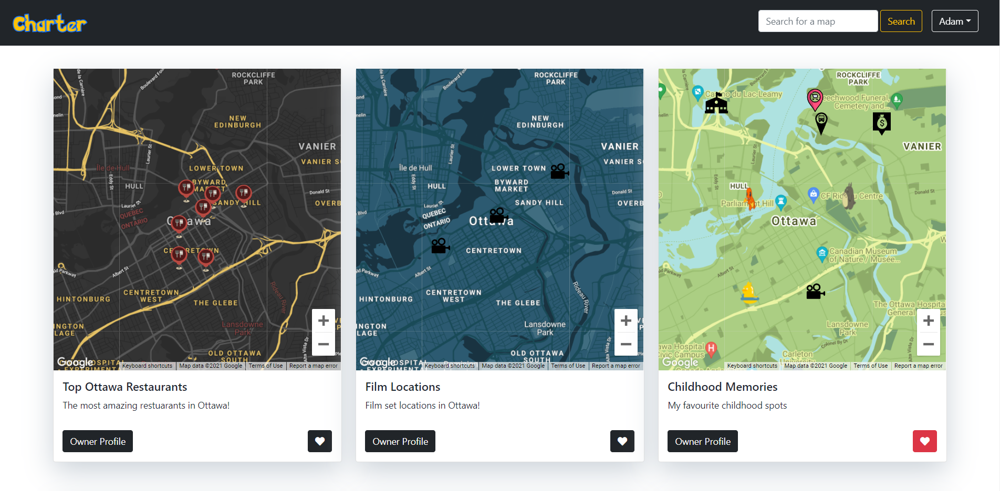
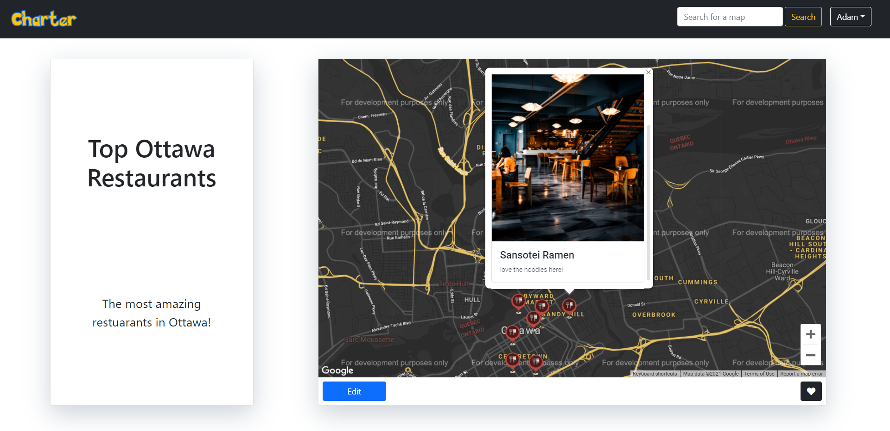
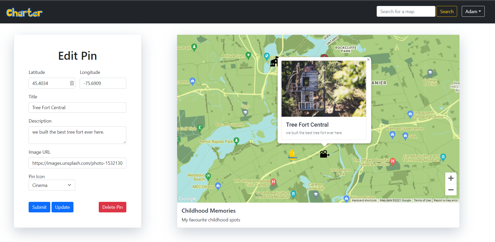
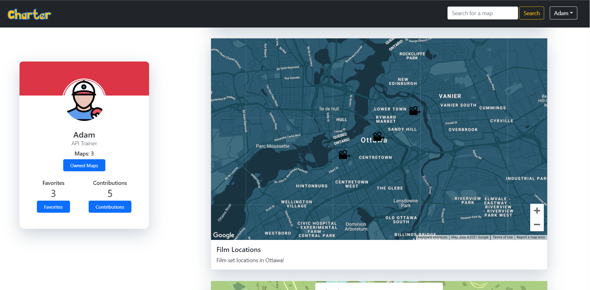

<h1 align="center"><a href="https://charter-map.herokuapp.com/maps">Charter</a></h1> 

## Table Of Contents
- [Summary](#summary)
  - [Features](#features)
  - [Screenshots](#screenshots)
- [Getting Started](#getting-started)
  - [Dependencies](#dependencies)
  - [Resources](#resources)
# Summary
Charter is a Node web application that allows users to collaboratively build maps and share points of interest with each other.
Demo app can be viewed at [charter.hirzalla.ca](https://charter-map.herokuapp.com/)

## Features
- Create, and share a map!
- Add, edit, or delete pins to a map!
- View other users' profiles along with their maps/contributions/favorites! 
- Choose from a bunch of marker icons and map themes!
- Add descriptions and images to pins to be viewed by others!
- Collaborate with others on their maps!
- Save your favourite maps!

## Screenshots

# Getting Started
1. Create the `.env` by using `.env.example` as a reference: `cp .env.example .env`
2. Update the .env file with your correct local information 
  - username: `labber` 
  - password: `labber` 
  - database: `midterm`
3. Install dependencies: `npm i`
4. Fix to binaries for sass: `npm rebuild node-sass`
5. Reset database: `npm run db:reset`
  - Check the db folder to see what gets created and seeded in the SDB
7. Run the server: `npm run local`
  - Note: nodemon is used, so you should not have to restart your server
8. Visit `http://localhost:8080/`

## Dependencies
- [Node 10.x or above](https://nodejs.org/en/)
- [Express 4.x or above](https://expressjs.com/)
- [NPM 5.x or above](https://docs.npmjs.com/)
- [PG 8.5 or above](https://node-postgres.com/)
- [Cookie Session 1.4 or above](https://www.npmjs.com/package/cookie-session)
- [Chalk 2.4 or above](https://www.npmjs.com/package/chalk)
- [Morgan 1.9 or above](https://www.npmjs.com/package/morgan)
- [Dotenv 2.0 or above](https://www.npmjs.com/package/dotenv)
- [jQuery 3.6 or above](https://jquery.com/)
- [EJS 2.6 or above](https://ejs.co/)
- [Sass 1.3 or above](https://sass-lang.com/)
- [Bootstrap 5.1](https://getbootstrap.com/)

## Resources
- [Unsplash](https://unsplash.com/)
- [Flaticon](https://www.flaticon.com/)
- [Font Awesome](https://fontawesome.com/)
- [SVG Repo](https://www.svgrepo.com/)
